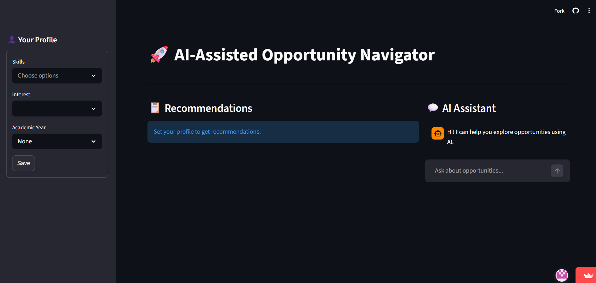
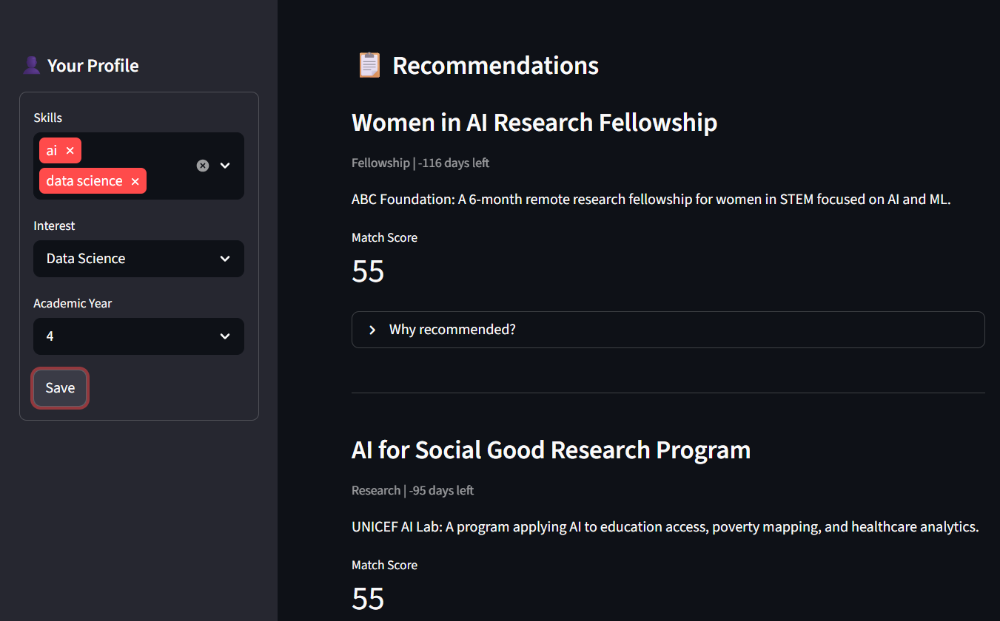
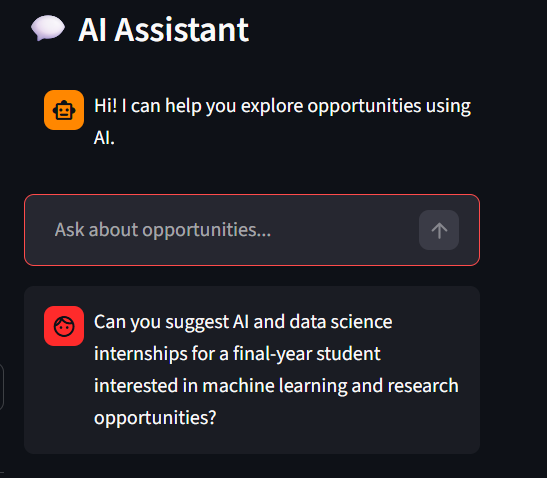

# 🚀 AI-Assisted Opportunity Navigator

An AI-powered web application designed to help students discover internships, fellowships, scholarships, and career opportunities based on their skills, interests, academic background, and career goals.

Developed as a collaborative hackathon project focused on responsible AI and student impact.

---

# 🧠 Problem Statement

Students often miss valuable opportunities because information is scattered across multiple platforms and eligibility requirements are difficult to track.

This project provides a centralized and personalized system that helps students identify relevant opportunities using explainable recommendation logic and AI-assisted guidance.

---

# ✨ Key Features

## 🎯 Personalized Opportunity Recommendations
- Matches opportunities based on:
  - Skills
  - Interests
  - Academic year
  - Eligibility criteria
  - Deadlines

---

## 📊 Explainable Scoring System
- Transparent rule-based recommendation logic
- Explains why opportunities are recommended
- Reduces bias and improves trust

---

## 💬 AI Career Assistant
- Provides conversational guidance using the Mistral LLM
- Helps users explore career paths and opportunities
- Assists when exact opportunity matches are unavailable

---

## 🔐 Privacy-Friendly AI
- Runs locally using Ollama
- No cloud APIs or API keys required
- Supports offline AI interaction

---

## 🎨 Modern User Interface
- Developed using Streamlit
- Interactive and user-friendly layout
- Custom dark-themed UI for enhanced user experience

---

# 🛠 Technologies Used

- **Python** – Backend logic and application functionality
- **Streamlit** – Web application framework
- **Mistral LLM** – AI conversational assistance
- **Ollama** – Local AI runtime
- **Rule-Based Recommendation Logic** – Opportunity matching system

---

# 🤖 How AI Is Used

AI is used specifically for conversational career guidance, while opportunity recommendations are generated using transparent rule-based logic.

This approach ensures:
- Explainable recommendations
- Reduced hallucinations
- Responsible AI usage
- Better reliability for users

---

# 📈 Application Workflow

1. User selects skills, interests, and academic year
2. System calculates relevance score using rule-based matching
3. Opportunities with higher relevance scores are displayed
4. AI assistant provides career guidance and recommendations

---

# 🎯 Use Cases

- Internship and fellowship discovery
- Scholarship recommendations
- Career guidance for students
- AI-focused academic demonstrations
- Hackathon project presentations

---

# 📸 Application Screenshots

## 🏠 Home Interface

Displays the main user interface with profile setup, recommendations section, and AI assistant.

---

## 🎯 Recommendation Results

Shows personalized opportunity recommendations with explainable scoring logic.

---

## 🤖 AI Assistant Interface

Demonstrates the conversational AI assistant for career and opportunity guidance.

---

# 📚 Key Learnings

- Streamlit web application development
- Integration of local LLMs using Ollama
- Explainable AI recommendation systems
- Rule-based scoring logic implementation
- Responsible AI design principles
- Team collaboration during hackathon development

---

# 👥 Team Contribution

Developed collaboratively as part of a hackathon project focused on responsible AI solutions for students.

---

# 🚧 Future Enhancements

- Resume-based opportunity matching
- Real-time opportunity scraping
- Bookmark and save functionality
- ML-based recommendation system
- User authentication and dashboards

---

# 🏆 Project Highlights

- AI-assisted opportunity guidance
- Privacy-first architecture
- Explainable recommendation engine
- Beginner-friendly AI integration project
- Real-world student-focused solution

---

# 📄 License

This project is intended for educational and hackathon purposes.
